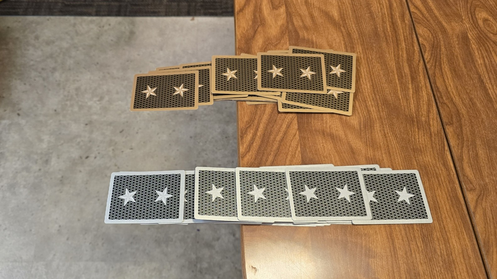
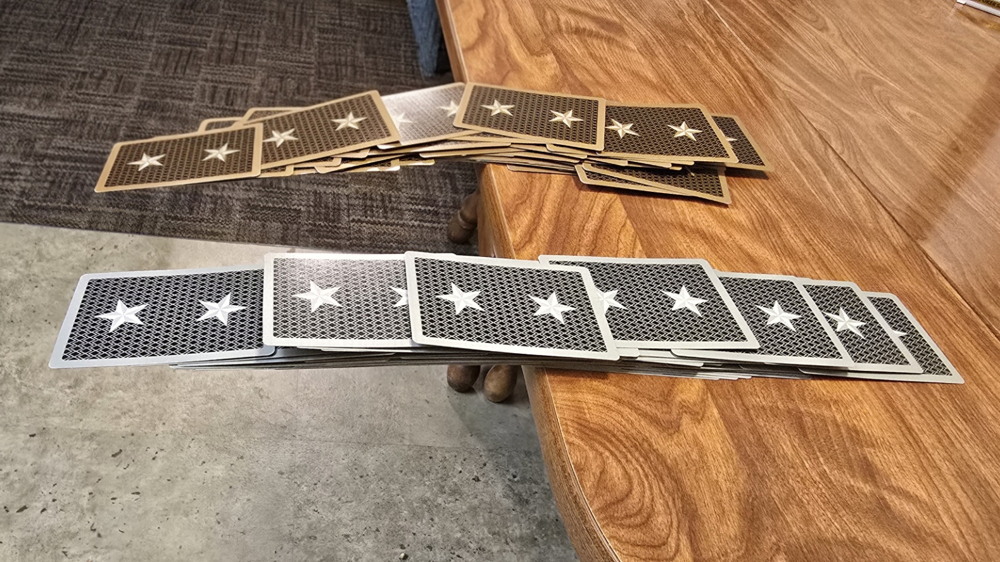
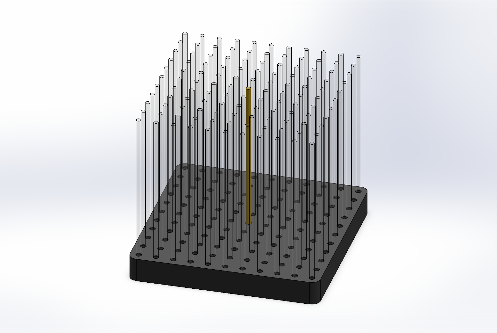
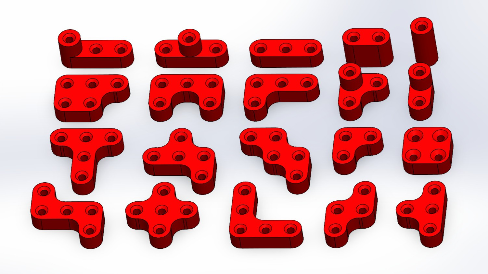
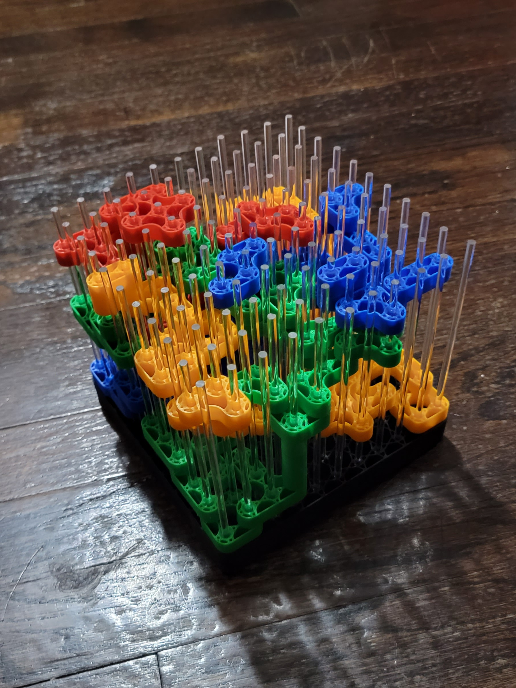

# Bridge Wars

**Design Objective**: The vast majority of board games utilize only two spatial dimensions. The objective of this project was to push past this limitation by designing a board game that utilizes all three spatial dimensions equally.

## Inspiration

When we were kids, my brother and I played a game in which we each tried to build a bridge extending from the edge of the table using a standard deck of cards. Whoever could make their bridge reach the farthest without collapsing won (see figures below).

<figure>
  

</figure>

Inspiration for Bridge Wars came from considering how I might combine the mechanics of this childhood card-stacking bridge game with those of popular polyomino-based (see [Wikipedia:Polyomino](https://en.wikipedia.org/wiki/Polyomino)) strategy games to create a fully three-dimensional board game.

## Gameplay

I came up with the idea of a game where players build "bridges" by stacking overhanging blocks onto previously placed pieces, competing to control the largest top-down projected area.

I developed the rules for gameplay first, striving to keep them as few and simple as possible. The full game rules can be viewed here: 
<a href="assets/PDFs/Bridge-Wars-Rules.pdf"> <svg class="inline-icon" aria-hidden="true"><use href="#icon-pdf"></use></svg>Bridge Wars Rules</a>

<iframe width="560" height="315" 
    src="https://www.youtube.com/embed/RaaJ51OsLo8?autoplay=1&loop=1&playlist=RaaJ51OsLo8&mute=1" 
    frameborder="0" 
    allow="accelerometer; autoplay; clipboard-write; encrypted-media; gyroscope; picture-in-picture" 
    allowfullscreen>
</iframe>

## Board Design

The primary design challenge for this game was figuring out how to support overhanging blocks.
I solved this by using vertical rods to limit each piece’s motion to translation up and down the rods.
Wooden dowels were used in early prototypes and later replaced with acrylic rods to improve visibility inside the play area.

<figure>
  
</figure>

## Piece Design

The strategy of Bridge Wars revolves around a tradeoff between gaining height and spreading out. To prevent any single piece from dominating, the following design constraints were applied:
1. All pieces must consist of 5 or fewer cubes.
2. To limit horizontal reach, no piece may extend more than 3 units in any direction (i.e., all pieces fit within a 3×3×3 unit cube).
3. To reinforce the height–spread tradeoff:
   * Pieces 2 units tall must consist of 4 or fewer cubes.
   * Pieces 3 units tall cannot spread horizontally, leaving only a single 1x1x3 piece.

<figure>
  
</figure>

## Prototype

With the design finalized, I 3D-printed the pieces and board base (with space removed to save on filament) and used acrylic stir sticks as the support rods to create a working prototype.
<figure>
  
</figure>